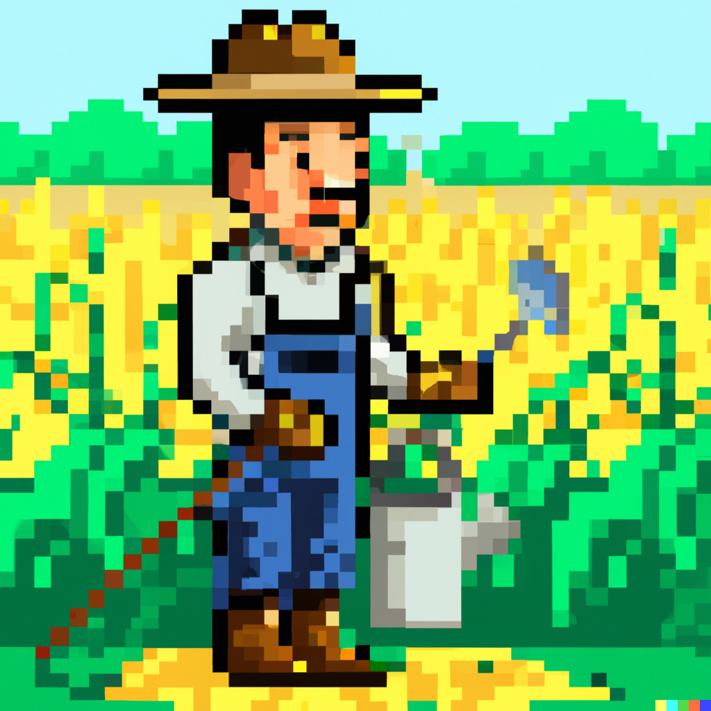

# CrossFarm



## Description

CrossFarm is an auto cross-chain yield aggregator with Axeler with a bit of gamification.

In the current ecosystem, Users have to wait so long to get their token bridged to the destination chain to start staking in the new chain. CrossFarm combines those bridge Tx with staking Tx into one.

This is like an aggregator of multichain yield aggregators.

And some gamification for fun!!

## Pitch Deck

https://docs.google.com/presentation/d/12TXKI9oDoNG4F57UUpacoMl2qi--gMnjNsK9GI1LHt0/edit?usp=sharing

## Demo Video

https://youtu.be/nxcAjN2dANA

## How it is made

### Moralis API

Used for fetching multichain wallet token balance

- Backend

  - https://github.com/taijusanagi/crossfarm/blob/main/packages/app/src/pages/api/token.ts#L17

- Fronend

  - https://github.com/taijusanagi/crossfarm/blob/main/packages/app/src/hooks/useAccountTokenAmount.tsx#L45

### Axeler

Used for cross-chain messaging

## Deployed Contract

See the following file deployments sections, contract is deployed Polygon, BSC, Fantom testnet.

https://github.com/taijusanagi/crossfarm/blob/main/packages/contracts/network.json

## Tested Transaction

### Goerli => BNB

#### Bridge

https://testnet.axelarscan.io/gmp/0x72c2c7b3b9e22536e9d5cdbef15fa36b993e7026969d2e80234c6aed9c87c7c4

#### Automated Staking

https://testnet.bscscan.com/tx/0x1cc258f62acf339e44c754b3362bc47c873cc433ec7b9bdb9e36eeb380e25885

### Goerli => FANTOM

#### Bridge

https://testnet.axelarscan.io/gmp/0x1890a0c61f297a586886c0eb5d4dfb6b3d0fb80abbcfa95414937881a2e55b72

#### Automated Staking

https://testnet.ftmscan.com/tx/0x6b8415eb3e81cd55d74e1e605aba1672469f1fa146e254c89e9d27ed64370d06

### Goerli => Polygon

#### Bridge

https://testnet.axelarscan.io/gmp/0x69cbc10d0ab63d916610354d970793e65e33e6491ab7b3bbed6ab3cd922c6fc3

#### Automated Staking

https://mumbai.polygonscan.com/tx/0xe6a463a95bbaa5caca178db596ef3226fc730e2ac57aff5cc32afb62f934f5dd

## Development

```
yarn
yarn dev
```
